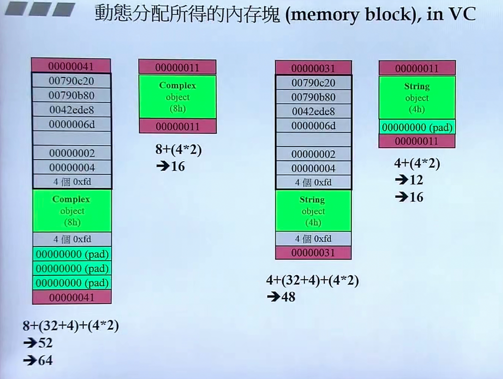
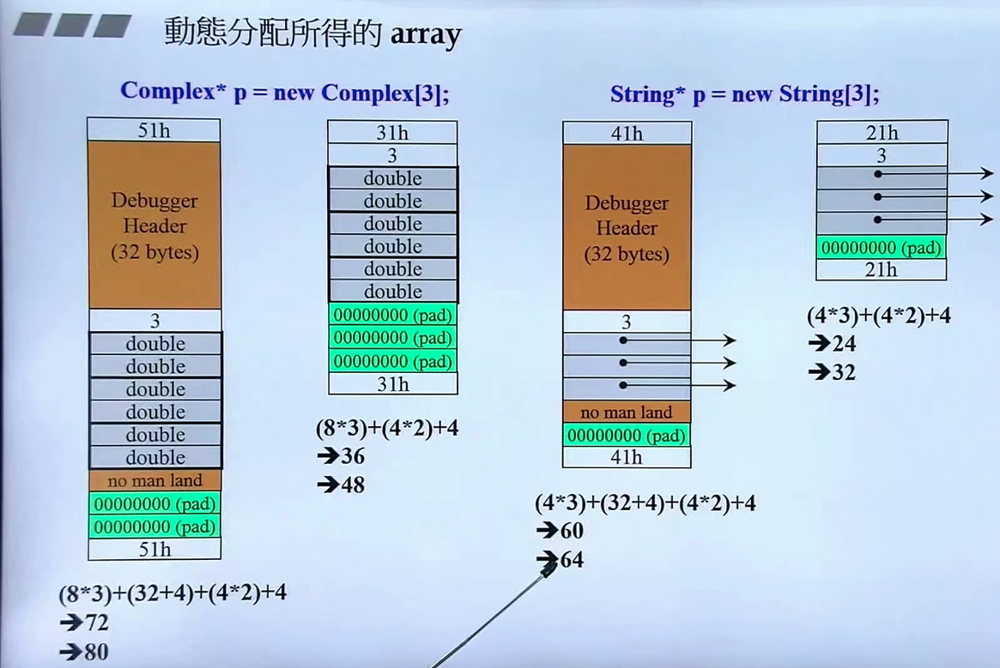
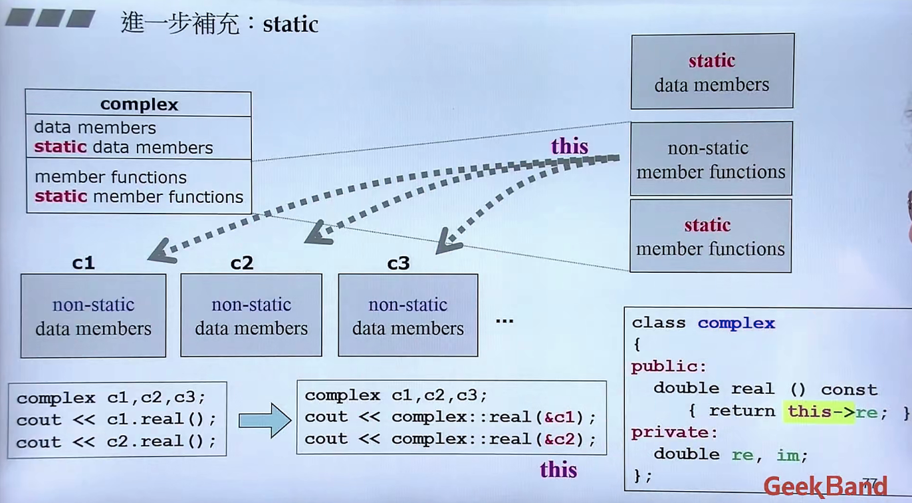

[TOC]

### C++书籍推荐

---

C++ 书籍：
#### 基础
《C++ Primer》（作者是C++第一个编译器的开发者）
《C++ Prpgramming Language》（作者是C++之父）

#### 专家建议

《Effective C++》

#### STL模板库

《The C++ Standard Library》
《STL源码剖析》

#### 方案

1. 《C++ Primer》
2. 《深度探索C++对象模型》
3. 《Effective C++》
4. （可选）写windows应用程序：《windows核心编程》
5. （可选）写linux应用程序：《UNIX环境高级编程》
6. 《设计模式：可复用面向对象软件的基础》
7. （模板）《C++ Templates: The Complete Guide》


### 单例模式 singleton
---
```
class A P
{
pubilc:
    static A& getInstance();
    setup() {...}
private:
    A();
    A(const A& rhs);
    ...
};

A& A::getInstance() 
{
    static A a;
    return a;
}
```


### 所谓stack(栈) 所谓heap(堆)

---
Stack，是存在于某作用域（scope）的一块内存空间（memory space）。
例如当你调用函数，函数本身即会形成一个stack用来放置它所接收的参数，以及返回的地址。
在函数本体（function body）内声明的任何变量，其所是用的内存块都取自上述stack。

Heap，或谓system heap，是指由操作系统提供的一块全局（global）内存空间，程序可动态分配（dynamic allocated）从其中获得若干区块（blocks）。
可以在程序任何位置以new的方式动态获得，切记获取后要去释放。

1. c1所占用的空间来自stack，c1便是所谓的stack object，其生命在作用域（scope）结束之际结束。这个作用域内的object，又称为auto object，因为它会被自动清空
2. c2便是所谓的static object，其生命在作用域（scope）结束之后仍然存在，直到整个程序结束
3. c3便是所谓的global object（全局对象），其生命在程序结束之后才结束，也可以把它视为一种static object，其作用域是整个程序
4. complex(3)是个临时对象，所占用的空间是以new自heap动态分配得到，并由p指向
5. p所指的便是heap object，其生命在它被delete时结束，如果不加delete，则会出现内存泄露（memory leak），因为当作用域结束，p所指向的heap object仍然存在，但指针p的生命却结束了，作用域之外再也看不到p（也就没机会delete p）


```
class Complex { ... };
...
Complex c3(1, 2);

{
    Complex c1(1, 2);
    static Complex c2(1, 2);
    Complex* p = new Complex(3);
    ...
    delete p;
}
```

#### new：先分配memory，再调用ctor（构造函数）

```C++
Complex* pc = new Complex(1, 2);

// 编译器转化为：

// 1.分配内存，其内部调用malloc(n)，即先分配内存
void mem = operator new(sizeof(Complex));

// 2.转型
pc = static_cast<Complex*>(mem);

// 3.构造函数，相当于 Complex::Complex(this,1,2); 这里的this相当于pc
pc->Complex::Complex(1, 2);
```

#### delete：先调用dtor（析构函数），再释放内存

```C++
Complex* pc = new String("Hello");
...
delete ps;

// 编译器转化为

// 1.析构函数，析构的是类中的指针类型的私有变量
String::~String(ps);

// 2. 释放内存，其内部调用free(ps)，释放的ps本身占用的内存
operator delete(ps);
```

#### new操作时内存块剖析

红色的是上下cookie（每个cookie 4个byte），作用是记录整块分配的大小，方便之后回收。pad相当于补位，分配的空间不为16的倍数时才进行分配。对于复数，左侧为调试模式下分配的空间，右侧为非调试模式。





array new 一定要搭配array delete，理由参下：

按照delete[] p这种方式写的时候，编译器才知道要释放的是一个数组，才回去调用3次析构函数。内存泄露的是未delete的数组元素所占的内存空间。


### 补充：static

---

非静态成员函数会默认传入this指针，this pointer在成员函数中省略，编译器会自动补全。



静态成员函数在内存中只有一份，与对象无关，脱离于对象之外。

静态函数没有this pointer，因此不能够像一般的成员函数那样去处理类中的私有变量，静态函数要处理数据的话只能处理静态数据。

比如：

```C++
// 银行账户
class Account {
public:
	static double m_rate;	// 利率，这里是对变量的声明
	static void set_rate(const double& x) { m_rate = x };
};
// 如果是静态数据，一定要在class外做下面这样的操作，这种操作严格来讲叫定义，要不要给初值都可以
double Account::m_rate = 8.0;

int main() {
    /*
    	调用static函数的方式有两种：
    	1.通过object调用
    	2.通过class name调用
    */
    Account::set_rate(5.0);		// 2
    
    Acount a;
    a.set_rate(7.0);			// 1
}
```


#### 单例模式：把ctors放在private区

```C++
class A {
public:
    static A& getInstance(return a;);
    setup() {...}
private:
    A();
    A(const A& rhs);
    static A a;
    ...
};

// 外界调用时，只能通过 A::getInstance.setup(); 这种方式来调用

// 更好的写法参下，即如果没有任何人使用，单例不会存在
class A {
public:
    static A& getInstance();
    setup() {...}
private:
    A();
    A(const A& rhs);
    ...
};

A& A::getInstance() {
    static A a;
    return a;
}
```


### 补充：cout

----

```C++
class ostream : virtual public ios
{
public:
	ostream& operator << (char c);
    ostream& operator << (unsigned char c) { return (*this) << (char)c; }
    ostream& operator << (signed char c) { return (*this) << (char)c; }
    ostream& operator << (const char *s);
    ostream& operator << (const unsigned char *s) { return (*this) << (const char*)s; }
    ostream& operator << (const signed char *s) { return (*this) << (const char*)s; }
    ostream& operator << (const void *p);
    ostream& operator << (int n);
    ostream& operator << (unsigned int n);
    ostream& operator << (long n);
    ostream& operator << (unsigned long n);
}

class _IO_ostream_withassign
    : public ostream {
...      
};

extern _IO_ostream_withassign cout;
```


### 补充：class template，类模板

---

```C++
template<typename T>
class complex
{
public:
	complex (T r = 0, T i = 0) : re(r), im(i) {}
    complex& operator += (const complex&);
    T real() const { return re; }
    T imag() const { return im; }
private:
    T re, im;
    
    friend complex& __doapl(complex*, const complex&);
}

// 调用
{
    complex<double> c1(2.5, 1.5);
    complex<int> c2(2, 6);
    ...
}
```

所以从调用的角度看，有一种观点认为模板可能会造成代码膨胀，但这种膨胀是必要的，并非是负面的，而是切实业务需要。


### 补充：function template，函数模板

----

```C++
class stone
{
public:
    stone(int w, int h, int we) : _w
}

stone r1(2,3), r2(3,3), r3;
r3 = min(r1, r2);


```


