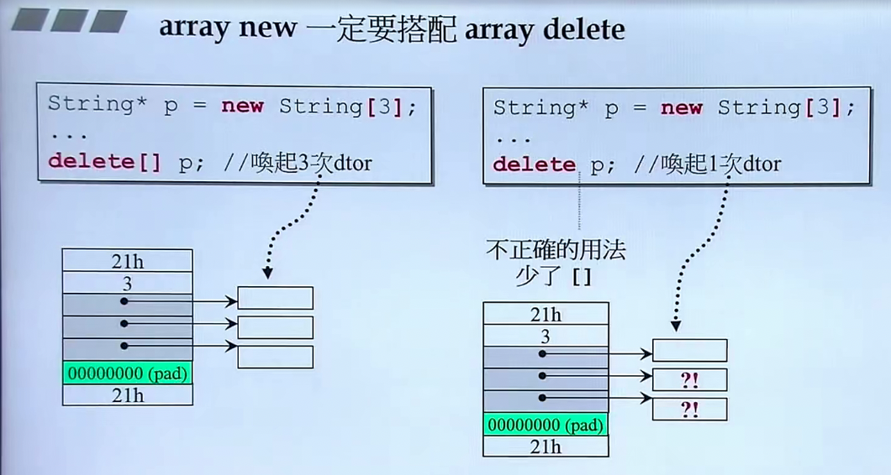

[TOC]

### C++书籍推荐

---

C++ 书籍：
#### 基础
《C++ Primer》（作者是C++第一个编译器的开发者）
《C++ Prpgramming Language》（作者是C++之父）

#### 专家建议

《Effective C++》

#### STL模板库

《The C++ Standard Library》
《STL源码剖析》

#### 方案

1. 《C++ Primer》
2. 《深度探索C++对象模型》
3. 《Effective C++》
4. （可选）写windows应用程序：《windows核心编程》
5. （可选）写linux应用程序：《UNIX环境高级编程》
6. 《设计模式：可复用面向对象软件的基础》
7. （模板）《C++ Templates: The Complete Guide》


### 单例模式 singleton
---
```
class A P
{
pubilc:
    static A& getInstance();
    setup() {...}
private:
    A();
    A(const A& rhs);
    ...
};

A& A::getInstance() 
{
    static A a;
    return a;
}
```


### 所谓stack(栈) 所谓heap(堆)

---
Stack，是存在于某作用域（scope）的一块内存空间（memory space）。
例如当你调用函数，函数本身即会形成一个stack用来放置它所接收的参数，以及返回的地址。
在函数本体（function body）内声明的任何变量，其所是用的内存块都取自上述stack。

Heap，或谓system heap，是指由操作系统提供的一块全局（global）内存空间，程序可动态分配（dynamic allocated）从其中获得若干区块（blocks）。
可以在程序任何位置以new的方式动态获得，切记获取后要去释放。

1. c1所占用的空间来自stack，c1便是所谓的stack object，其生命在作用域（scope）结束之际结束。这个作用域内的object，又称为auto object，因为它会被自动清空
2. c2便是所谓的static object，其生命在作用域（scope）结束之后仍然存在，直到整个程序结束
3. c3便是所谓的global object（全局对象），其生命在程序结束之后才结束，也可以把它视为一种static object，其作用域是整个程序
4. complex(3)是个临时对象，所占用的空间是以new自heap动态分配得到，并由p指向
5. p所指的便是heap object，其生命在它被delete时结束，如果不加delete，则会出现内存泄露（memory leak），因为当作用域结束，p所指向的heap object仍然存在，但指针p的生命却结束了，作用域之外再也看不到p（也就没机会delete p）


```
class Complex { ... };
...
Complex c3(1, 2);

{
    Complex c1(1, 2);
    static Complex c2(1, 2);
    Complex* p = new Complex(3);
    ...
    delete p;
}
```

#### new：先分配memory，再调用ctor（构造函数）

```C++
Complex* pc = new Complex(1, 2);

// 编译器转化为：

// 1.分配内存，其内部调用malloc(n)，即先分配内存
void mem = operator new(sizeof(Complex));

// 2.转型
pc = static_cast<Complex*>(mem);

// 3.构造函数，相当于 Complex::Complex(this,1,2); 这里的this相当于pc
pc->Complex::Complex(1, 2);
```

#### delete：先调用dtor（析构函数），再释放内存

```C++
Complex* pc = new String("Hello");
...
delete ps;

// 编译器转化为

// 1.析构函数，析构的是类中的指针类型的私有变量
String::~String(ps);

// 2. 释放内存，其内部调用free(ps)，释放的ps本身占用的内存
operator delete(ps);
```

#### new操作时内存块剖析

红色的是上下cookie（每个cookie 4个byte），作用是记录整块分配的大小，方便之后回收。pad相当于补位，分配的空间不为16的倍数时才进行分配。对于复数，左侧为调试模式下分配的空间，右侧为非调试模式。


array new 一定要搭配array delete，理由参下：

按照delete[] p这种方式写的时候，编译器才知道要释放的是一个数组，才回去调用3次析构函数。内存泄露的是未delete的数组元素所占的内存空间。




### 补充

----


#### 补充：static

---

非静态成员函数会默认传入this指针，this pointer在成员函数中省略，编译器会自动补全。


静态成员函数在内存中只有一份，与对象无关，脱离于对象之外。

静态函数没有this pointer，因此不能够像一般的成员函数那样去处理类中的私有变量，静态函数要处理数据的话只能处理静态数据。

比如：

```C++
// 银行账户
class Account {
public:
	static double m_rate;	// 利率，这里是对变量的声明
	static void set_rate(const double& x) { m_rate = x };
};
// 如果是静态数据，一定要在class外做下面这样的操作，这种操作严格来讲叫定义，要不要给初值都可以
double Account::m_rate = 8.0;

int main() {
    /*
    	调用static函数的方式有两种：
    	1.通过object调用
    	2.通过class name调用
    */
    Account::set_rate(5.0);		// 2
    
    Acount a;
    a.set_rate(7.0);			// 1
}
```


##### 单例模式：把ctors放在private区

```C++
class A {
public:
    static A& getInstance(return a;);
    setup() {...}
private:
    A();
    A(const A& rhs);
    static A a;
    ...
};

// 外界调用时，只能通过 A::getInstance.setup(); 这种方式来调用

// 更好的写法参下，即如果没有任何人使用，单例不会存在
class A {
public:
    static A& getInstance();
    setup() {...}
private:
    A();
    A(const A& rhs);
    ...
};

A& A::getInstance() {
    static A a;
    return a;
}
```


#### 补充：cout

----

```C++
class ostream : virtual public ios
{
public:
	ostream& operator << (char c);
    ostream& operator << (unsigned char c) { return (*this) << (char)c; }
    ostream& operator << (signed char c) { return (*this) << (char)c; }
    ostream& operator << (const char *s);
    ostream& operator << (const unsigned char *s) { return (*this) << (const char*)s; }
    ostream& operator << (const signed char *s) { return (*this) << (const char*)s; }
    ostream& operator << (const void *p);
    ostream& operator << (int n);
    ostream& operator << (unsigned int n);
    ostream& operator << (long n);
    ostream& operator << (unsigned long n);
}

class _IO_ostream_withassign
    : public ostream {
...      
};

extern _IO_ostream_withassign cout;
```


#### 补充：class template，类模板

---

```C++
template<typename T>
class complex
{
public:
	complex (T r = 0, T i = 0) : re(r), im(i) {}
    complex& operator += (const complex&);
    T real() const { return re; }
    T imag() const { return im; }
private:
    T re, im;
    
    friend complex& __doapl(complex*, const complex&);
}

// 调用
{
    complex<double> c1(2.5, 1.5);
    complex<int> c2(2, 6);
    ...
}
```

所以从调用的角度看，有一种观点认为模板可能会造成代码膨胀，但这种膨胀是必要的，并非是负面的，而是切实业务需要。


#### 补充：function template，函数模板

----

```C++
class stone
{
public:
    stone(int w, int h, int we) : _w(w), _h(h), _weight(we){}
    bool operator< (const stone& rhs) const { return _weight < rhs._weight; }

private:
    int _w, _h, _weight;
};

template <class T>
inline const T& min(const T& a, const T& b) {
    return b < a ? b : a;
}

// 编译器会对 function template 进行引数推导（argument deduction）
// 引数推导的结果，T 为 stone，于是调用 stone::operator<
stone r1(2,3), r2(3,3), r3;
r3 = min(r1, r2);
```


#### 补充：namespace

----

防止当前文件中的代码与其他部分代码中的函数、方法等重名。

```C++
namespace std
{
	...
}

// 1. using directive 使用命令，放开命名空间。直接使用std下的所有方法
# include <iostream>
using namespace std;
int main() {
    cin << ...;
    cout << ...;
}

// 2. using declaration 使用声明，
#include <iostream>
using std::cout;
int main() {
    std::cin << ...;
    cout << ...;
    return 0;
}

// 3.不直接声明使用哪个命名空间或其方法
#include <iostream>
int main() {
    std::cin << ...;
    std::cout << ...;
    return 0;
}
```


#### 更多细节

```C++
// 可以用于某种转换函数
operator type() const;

// 前面加explicit关键字的构造函数
explicit complex(...) : initialization list {}

pointer-like object
function-like object
namespace
// 模板特化
template specialization 

Standard Library

// since C++ 11
variadic template
move ctor
Rvalue reference
auto
lambda
range-base for loop
unordered containers
```


### Object Oriented Programming, Object Oriented Design——OOP,OOD

---

面向对象编程、面向对象设计

1. Inheritance（继承）
2. Composition（复合）
3. Delegation（委托）


#### Composition 复合，表示has-a

```C++
template <class T, class Sequence = deque<T>>
class queue {
	...
protected:
    Sequence c;	// 底层容器
public:
    // 以下完全利用c的操作函数完成
    bool empty() const { return c.empty(); }
    size_type size() const { return c.size(); }
    reference front() { return c.front(); }
    reference back() { return c.back(); }
    // deque是两端可进出，queue是末端进前端出（先进先出）
    void push(const value_type& x) { c.push_back(x); }
    void pop() { c.pop_front(); }
};

// 上述代码相当于：
// queue -> deque（queue中有deque的东西）
template <class T>
class queue {
	...
protected:
    deque<T> c;	// 底层容器
public:
    // 以下完全利用c的操作函数完成
    bool empty() const { return c.empty(); }
    size_type size() const { return c.size(); }
    reference front() { return c.front(); }
    reference back() { return c.back(); }
    // deque是两端可进出，queue是末端进前端出（先进先出）
    void push(const value_type& x) { c.push_back(x); }
    void pop() { c.pop_front(); }
};
```

上述类queue的代码也是一种设计模式，叫 Adapter（改造、适配、配接），适配器模式

下面从内存角度看composition：

```C++
// [queue] sizeof: 40
template <class T>
class queue {
protected:
	deque<T> c;
	...
};

// [deque] sizeof: 16 * 2 + 4 + 4
template <class T>
class deque {
protected:
	Itr<T> start;
	Itr<T> finish;
	T** map;
	unsigned int map_size;
};

// [Itr] sizeof: 4 * 4
template <class T>
struct Itr {
	T* cur;
	T* first;
	T* last;
	T** node;
...
};
```


##### Composition（复合）关系下的构造和析构

Container -> Component

1. 构造由内而外：

    Container 的构造函数首先调用 Component 的 default 构造函数，然后才执行自己。

    ```C++
    Container::Container(...) : Component() {...};
    ```

2. 析构由外而内：

    Container 的析构函数首先执行自己，然后才调用 Component 的析构函数。

    ```C++
    Container::~Container(...) { ... ~Component() };
    ```

要注意区分，上述代码中的Component()是编译器默认调用的，如果不符合个人习惯，就要自己去写。


#### Delegation（委托）Composition by reference

---

通过引用的复合（学术界中，即使用指针在传，也讲by reference）

Handle / Body (pImpl)，也叫编译防火墙。Handle是对外的接口，Body是真正的实现。这种方法的好处是，不管实现怎么变，都不会影响对外的接口。

下图中是发生共享的行为，发生共享的前提是一个对象想要改变内容时，不能影响别人。a想要修改的话，提供一份副本，b和c去共享内容。


##### 设计模式：Handle / Body (pImpl)

```C++
// Handle / Body (pImpl)，这种写法非常有名，pointer to implement

// file String.cpp
// Handle
// 该类下只放对外的接口，具体的方法不在这里写出来，真正的实现在StringRep类中做，当String需要动作的时候都调用StringRep中的方法进行处理
class StringRep;
class String {
public:
    String();
    String(const char* s);
    String(const String& s);
    String &operator = (const String& s);
    ~String();
	...
private:
    StringRep* rep;	// pimpl
};

// file String.cpp
// Body
#include "String.hpp"
namespace {
class StringRep {
    friend class String;
    StringRep(const char* s);
    ~StringRep();
    int count;
    char* rep;
};
}

String::String() { ... }
...
```


#### Inheritance（继承），表示 is-a

----

三种继承方式：public、private、protected。最重要的是public。父类的数据子类（派生类）被完全继承下来。最有价值的地方在于和虚函数搭配。

```C++
struct _List_node_base
{
	_List_node_base* _M_next;
	_List_node_base* _M_prev;
};

template<typename _Tp>
struct _List_node : public _List_node_base
{
	_Tp _M_data;
};
```


从内存的角度看：子类中有父类的成分。

1. 构造由内而外

    Derived的构造函数首先调用Base的default构造函数，然后才执行自己

    ```C++
    Derived::Derived(...) : Base() {...}
    ```

2. 析构由外而内

    Derived的析构函数首先执行自己，然后才调用Base的析构函数

    ```C++
    Derived::~Derived(...) { ... ~Base() };
    ```

父类的析构函数必须是虚函数，否则会出现undefined behavior


##### Inheritance (继承) with virtual functions (虚函数)

Non-virtual 函数：你不希望派生类（derived class）重新定义（override，覆写）它

Virtual 函数：你希望派生类重新定义它，并且对它已有默认定义

pure virtual 函数（纯虚函数）：你希望派生类一定要重新定义它，你对它没有默认定义

【==TODO==：纯虚函数是否可以有默认定义，只不过课程中没提到，可以后面查一下】

```C++
class Shape {
public:
    // pure virtual
	virtual void draw() const = 0;
	
    // impure virtual
    virtual void error(const std::string& msg);
	
    // non-virtual
    int objectID() const;
	...
};

class Rectangle : public Shape {...};
class Ellipse : public Shape {...};
```

函数的继承继承的是调用权，子类可以调用父类的函数。

##### 设计模式：Template Method

23种设计模式之一，在应用程序框架中设计方法，留下暂时无法实现的方法，使之成为虚函数，让子类去实现这个虚函数。比如，MFC。这是虚函数最经典、最重要的用途。

下图main函数中`myDoc.OnFileOpen();` 完整代码为`CDocument::OnFileOpen(&myDoc);`，调用者myDoc即为OnFileOpen的this指针，然后通过this指针调用子类中的serialize()方法。


上图过程的代码实现：

```C++
#inlcude <iostream>
using namespace std;

class CDocument
{
public:
    void OnFileOpen()
    {
        // 这是个算法，每个cout输出代表一个实际动作
        cout << "dialog..." << endl;
        cout << "check file status..." << endl;
        cout << "open file..." << endl;
        Serialize();
        cout << "close file..." << endl;
        cout << "update all views..." << endl;
    }
    
    virtual void Serialize() { };
};

class CMyDoc : public CDocument
{
public:
	virtual void Serialize()
    {
        // 只有应用程序本身才知道如何读取自己的文件（格式）
        cout << "CMyDoc::Serialize()" << endl;
    }
};

int main()
{
    CMyDoc myDoc;	// 假设对应[File/Open]
    myDoc.OnFileOpen();
}
```


#### 继承 + 复合关系下的构造和析构

---

【==TODO==】写代码观察两种模式下，谁先执行，谁后执行


#### Delegation(委托) + Inheritance(继承)

---

功能最强大的组合。


##### 设计模式：Observer

```C++
class Observer
{
public:
    virtual void update(Subject* sub, int value) = 0;
};

class Subject
{
	int m_value;
	vector<Observer*> m_views;
public:
	void attach(Observer* obs) {
		m_views.push_back(obs);
	}
    void set_val(int value) {
        m_value = value;
        notify();
    }
    void notify() {
        for (int i = 0; i < m_views.size(); ++i) {
            m_views[i]->update(this, m_value);
        }
    }
};
```


##### 设计模式：Composite


